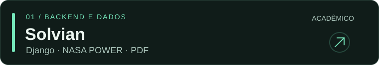
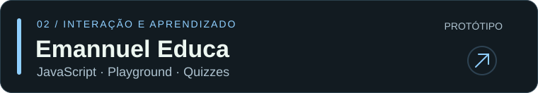
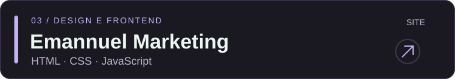

<p align="center">
  
</p>

<p align="center">
  <a href="https://emannuel.nabio.pro/"></a>
  <a href="https://www.linkedin.com/in/emannuelmardyan7/"></a>
  <a href="https://github.com/iamnothuman7?tab=repositories"></a>
</p>

## Sobre mim

Sou **Emannuel**, desenvolvedor full-stack na **NABIO**. Trabalho com aplicações web e produtos SaaS, conectando a experiência de quem usa o sistema às regras de negócio e à operação em produção.

Gosto de transformar processos complicados em interfaces que fazem sentido. Meu foco está em ferramentas de gestão, integrações e produtos úteis no dia a dia.

```python
class Emannuel:
    foco = "Full-stack & produtos SaaS"
    backend = ["Python", "Django", "PostgreSQL"]
    frontend = ["HTML", "CSS", "JavaScript"]
    operacao = ["Linux", "Git", "GitHub Actions"]

    def construir(self, ideia):
        return "entender → desenvolver → testar → evoluir"
```

## Tecnologias

**Backend e dados**


**Interface e experiência**


**Desenvolvimento e operação**


## Projetos selecionados

<a href="https://github.com/iamnothuman7/solvian"></a>

Dimensionamento solar, consulta de irradiação, análise de geração e propostas em PDF. Um projeto acadêmico para explorar integrações e cálculos em uma aplicação Django.

[Explorar código e documentação →](https://github.com/iamnothuman7/solvian)

<a href="https://github.com/iamnothuman7/emannuel-educa"></a>

Aprendizado de programação com lições, playground, quizzes e conquistas. Protótipo de frontend: contas e progresso são locais ao navegador; o assistente usa respostas predefinidas.

[Explorar código e documentação →](https://github.com/iamnothuman7/emannuel-educa)

<a href="https://github.com/iamnothuman7/emannuel.mkt"></a>

Apresentação profissional em uma página, com navegação mobile, animações e identidade visual própria.

[Ver site →](https://iamnothuman7.github.io/emannuel.mkt/) · [Explorar código →](https://github.com/iamnothuman7/emannuel.mkt)

## Produtos e trabalho comercial

Também desenvolvo produtos de gestão e sistemas de clientes na NABIO. Esses repositórios permanecem **privados**, preservando código de negócio, dados e integrações.

Os projetos acima são a parte pública do meu trabalho. Cada README apresenta o que está implementado, como executar e quais limitações ainda existem.

## Vamos conversar

Tem um produto, uma integração ou um processo que precisa virar software?

**[Conheça meu trabalho](https://emannuel.nabio.pro/) · [Fale comigo no LinkedIn](https://www.linkedin.com/in/emannuelmardyan7/)**
